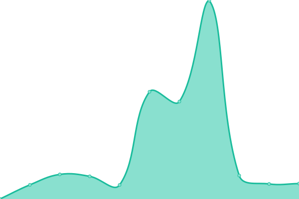
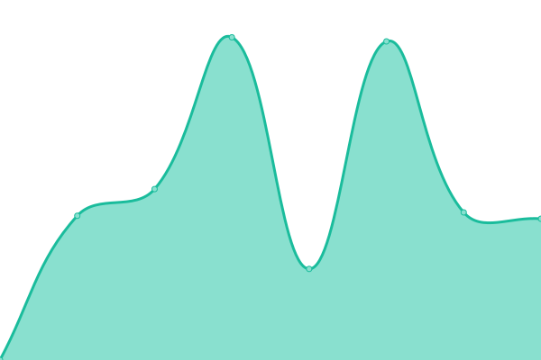

# [📈 Live Status](https://demo.upptime.js.org): <!--live status--> **🟩 All systems operational**

This repository contains the open-source uptime monitor and status page for [Upptime](https://upptime.js.org), powered by [Upptime](https://github.com/upptime/upptime).

With [Upptime](https://upptime.js.org), you can get your own unlimited and free uptime monitor and status page, powered entirely by a GitHub repository. We use [Issues](https://github.com/upptime/upptime/issues) as incident reports, [Actions](https://github.com/ryylmzki/upptime/actions) as uptime monitors, and [Pages](https://demo.upptime.js.org) for the status page.

<!--start: status pages-->
<!-- This summary is generated by Upptime (https://github.com/upptime/upptime) -->
<!-- Do not edit this manually, your changes will be overwritten -->
<!-- prettier-ignore -->
| URL | Status | History | Response Time | Uptime |
| --- | ------ | ------- | ------------- | ------ |
|  [Klienten-Info](https://www.klienten-info.at) | 🟩 Up | [klienten-info.yml](https://github.com/ryylmzki/upptime/commits/HEAD/history/klienten-info.yml) | 

 2348ms
     
 | 

<a href="https://ryylmzki.github.io/upptime/history/klienten-info">99.40%</a>
    

|  [Klienten-Info KiAdmin](https:/kiadmin.klienten-info.at) | 🟩 Up | [klienten-info-ki-admin.yml](https://github.com/ryylmzki/upptime/commits/HEAD/history/klienten-info-ki-admin.yml) | 

 787ms
     
 | 

<a href="https://ryylmzki.github.io/upptime/history/klienten-info-ki-admin">99.41%</a>
    

|  [ASKG](https://www.askg.at) | 🟩 Up | [askg.yml](https://github.com/ryylmzki/upptime/commits/HEAD/history/askg.yml) | 

 3185ms
     
 | 

<a href="https://ryylmzki.github.io/upptime/history/askg">99.25%</a>
    

|  [Peterka](https://www.peterka.at) | 🟩 Up | [peterka.yml](https://github.com/ryylmzki/upptime/commits/HEAD/history/peterka.yml) | 

 1087ms
     
 | 

<a href="https://ryylmzki.github.io/upptime/history/peterka">100.00%</a>
    

|  [Citytax](https://www.citytax.at) | 🟩 Up | [citytax.yml](https://github.com/ryylmzki/upptime/commits/HEAD/history/citytax.yml) | 

 2949ms
     
 | 

<a href="https://ryylmzki.github.io/upptime/history/citytax">100.00%</a>
    

|  [Muhr Steuerberatung](https://www.muhr-steuerberatung.at/) | 🟩 Up | [muhr-steuerberatung.yml](https://github.com/ryylmzki/upptime/commits/HEAD/history/muhr-steuerberatung.yml) | 

 5914ms
     
 | 

<a href="https://ryylmzki.github.io/upptime/history/muhr-steuerberatung">98.01%</a>
    

|  [Marihart](https://www.marihart.at) | 🟩 Up | [marihart.yml](https://github.com/ryylmzki/upptime/commits/HEAD/history/marihart.yml) | 

 1068ms
     
 | 

<a href="https://ryylmzki.github.io/upptime/history/marihart">100.00%</a>
    

|  [Alpha Consult](https://www.alpha-consult.at) | 🟩 Up | [alpha-consult.yml](https://github.com/ryylmzki/upptime/commits/HEAD/history/alpha-consult.yml) | 

 1215ms
     
 | 

<a href="https://ryylmzki.github.io/upptime/history/alpha-consult">100.00%</a>
    

<!--end: status pages-->

[**Visit our status website →**](https://demo.upptime.js.org)

## 📄 License

- Powered by: [Upptime](https://github.com/upptime/upptime)
- Code: [MIT](./LICENSE) © [Upptime](https://upptime.js.org)
- Data in the `./history` directory: [Open Database License](https://opendatacommons.org/licenses/odbl/1-0/)
